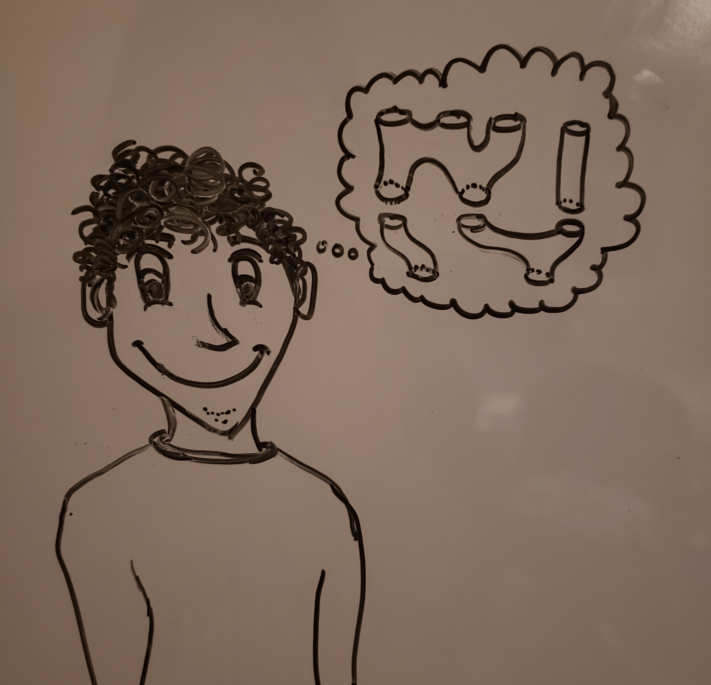

---
---

<!-- Global site tag (gtag.js) - Google Analytics -->

 

Hi, I'm Rohil, a PhD student studying mathematics at [Princeton](https://www.math.princeton.edu/people/rohil-prasad). I'm interested in geometry and dynamics. My advisor is [Helmut Hofer](https://www.math.ias.edu/people/faculty/hofer). 

You can reach me at rrprasad \[email symbol goes here\] princeton.edu. 
